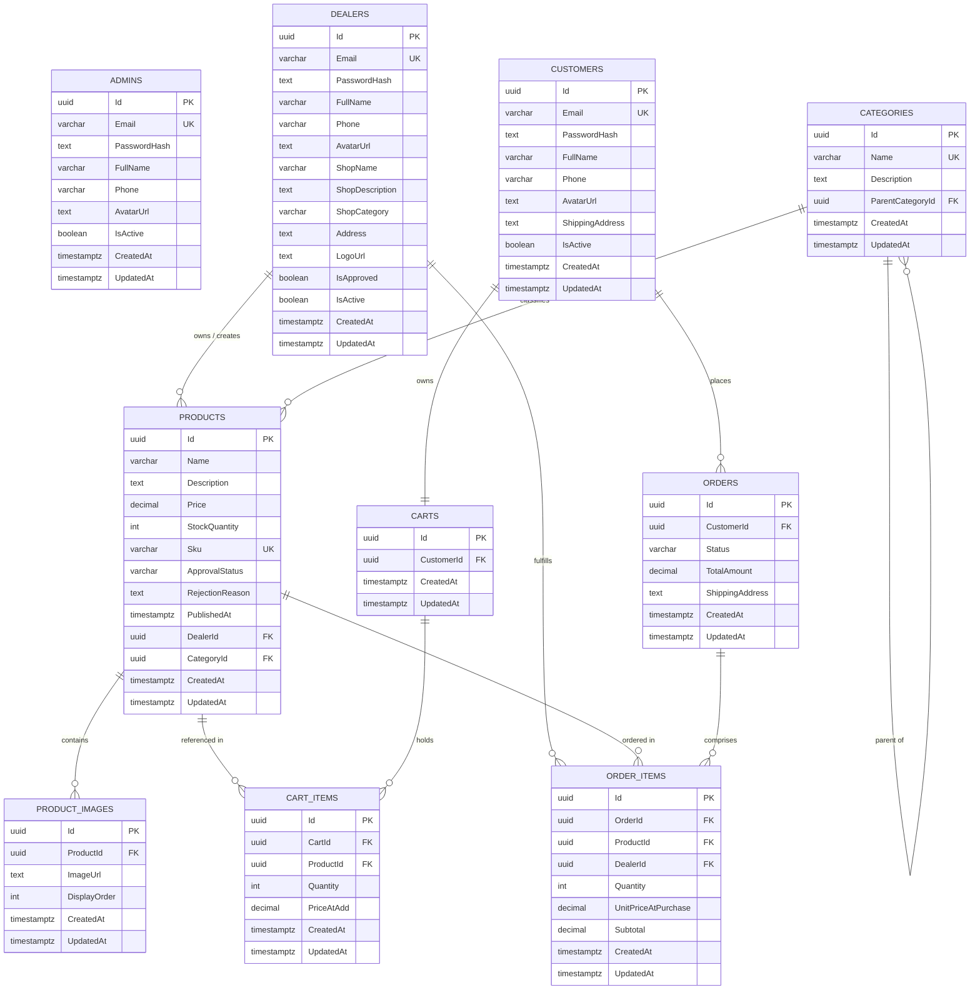

# MULTI-VENDOR E-COMMERCE PLATFORM
## Comprehensive Final Project Report & Architectural Documentation

**Project Title:** Multi-Vendor E-Commerce Platform with Dealer Product Approval Workflow  
**Project Category:** Full-Stack Enterprise Web Application / University Final Year Capstone Project  
**Author / Developer:** md.prantoislam  
**Backend Framework:** ASP.NET Core Web API (.NET 9.0)  
**Frontend Framework:** Next.js 14 (App Router, TypeScript, Tailwind CSS)  
**Database System:** PostgreSQL 14+ on Supabase Cloud  
**Completion Date:** September 15, 2026  
**Project Status:** 100% Feature-Complete & Production-Ready  

---

## Executive Summary

The **Multi-Vendor E-Commerce Platform** is an enterprise-grade digital marketplace application designed to provide a secure, scalable, and intuitive environment where multiple independent merchants (dealers) can market and sell their goods while end-users (customers) can discover, purchase, and track products across diverse categories. 

A central architectural differentiator of this platform is the **Dealer Product Approval Workflow**. Unlike open unmoderated marketplaces where counterfeit, duplicate, or inappropriate product listings harm consumer confidence, this platform enforces a formal quality-control gatekeeper: every newly drafted product by a vendor begins in a `Pending` state and remains strictly concealed from the public storefront until verified, reviewed, and approved by a platform Administrator.

The application is architected around the principles of **Clean Architecture** (Onion Architecture) in .NET 9.0, maintaining strict boundary separation between Domain, Application, Infrastructure, and Presentation layers. The backend exposes over 35 RESTful endpoints authenticated via stateless JSON Web Tokens (JWT) with BCrypt-hashed credentials. The persistence layer leverages **PostgreSQL on Supabase Cloud** through Entity Framework Core 9.0, utilizing a role-segregated 10-table schema that eliminates single-table collision and guarantees multi-tenant data privacy. 

The frontend is constructed using **Next.js 14 with the App Router**, React 18, TypeScript, and Tailwind CSS. It features custom UI components including client-side image encoding (`ImageUploadInput`), multi-stage animated loading indicators (`LoadingProgress`), extended modal dialogs, real-time cart state management, and role-guarded workspaces for Administrators, Dealers, and Customers.

---

# Table of Contents

- [Chapter 1: Introduction](#chapter-1-introduction)
  - [1.1 Project Background](#11-project-background)
  - [1.2 Problem Statement](#12-problem-statement)
  - [1.3 Objectives](#13-objectives)
  - [1.4 Scope of the Project](#14-scope-of-the-project)
  - [1.5 Report Organization](#15-report-organization)
- [Chapter 2: Literature Review & Technology Overview](#chapter-2-literature-review--technology-overview)
  - [2.1 ASP.NET Core and .NET 9.0](#21-aspnet-core-and-net-90)
  - [2.2 Entity Framework Core 9.0 & Npgsql](#22-entity-framework-core-90--npgsql)
  - [2.3 PostgreSQL & Supabase Cloud Architecture](#23-postgresql--supabase-cloud-architecture)
  - [2.4 Next.js 14 (App Router Architecture)](#24-nextjs-14-app-router-architecture)
  - [2.5 TypeScript and React 18](#25-typescript-and-react-18)
  - [2.6 Tailwind CSS & Custom Design System](#26-tailwind-css--custom-design-system)
  - [2.7 JWT (JSON Web Token) Security Architecture](#27-jwt-json-web-token-security-architecture)
  - [2.8 BCrypt Cryptographic Password Hashing](#28-bcrypt-cryptographic-password-hashing)
  - [2.9 Clean Architecture Pattern](#29-clean-architecture-pattern)
  - [2.10 RESTful API Principles](#210-restful-api-principles)
- [Chapter 3: System Analysis and Design](#chapter-3-system-analysis-and-design)
  - [3.1 Requirements Analysis](#31-requirements-analysis)
  - [3.2 System Architecture](#32-system-architecture)
  - [3.3 Database Design & Entity Relationship Modeling](#33-database-design--entity-relationship-modeling)
  - [3.4 API Architecture & Route Catalog](#34-api-architecture--route-catalog)
  - [3.5 UI/UX Design System & Layouts](#35-uiux-design-system--layouts)
- [Chapter 4: Implementation](#chapter-4-implementation)
  - [4.1 Development Environment & Tooling](#41-development-environment--tooling)
  - [4.2 Database Implementation & Seeding Strategy](#42-database-implementation--seeding-strategy)
  - [4.3 Backend Implementation (Clean Architecture Layers)](#43-backend-implementation-clean-architecture-layers)
  - [4.4 Frontend Implementation (Next.js 14 App Router)](#44-frontend-implementation-nextjs-14-app-router)
  - [4.5 Core Feature Workflows](#45-core-feature-workflows)
- [Chapter 5: Testing, Verification & Results](#chapter-5-testing-verification--results)
  - [5.1 Testing Methodology](#51-testing-methodology)
  - [5.2 API Verification with cURL](#52-api-verification-with-curl)
  - [5.3 Frontend Component & Flow Testing](#53-frontend-component--flow-testing)
  - [5.4 Verification Matrix](#54-verification-matrix)
- [Chapter 6: Conclusion, Challenges & Future Roadmap](#chapter-6-conclusion-challenges--future-roadmap)
  - [6.1 Summary of Achievements](#61-summary-of-achievements)
  - [6.2 Key Challenges & Engineering Solutions](#62-key-challenges--engineering-solutions)
  - [6.3 Lessons Learned](#63-lessons-learned)
  - [6.4 Future Roadmap](#64-future-roadmap)
- [References](#references)
- [Appendices](#appendices)
  - [Appendix A: Master Database Schema (SQL)](#appendix-a-master-database-schema-sql)
  - [Appendix B: Complete API Endpoint Reference](#appendix-b-complete-api-endpoint-reference)
  - [Appendix C: Master Demonstration Credentials](#appendix-c-master-demonstration-credentials)
  - [Appendix D: System Configuration & Scripts](#appendix-d-system-configuration--scripts)

---

# Chapter 1: Introduction

## 1.1 Project Background
The rapid growth of the global e-commerce industry has demonstrated the undeniable advantages of multi-vendor marketplace architectures over monolithic single-retailer stores. Modern consumers demand vast product variety, competitive pricing, and immediate availability—requirements that an individual vendor can rarely fulfill in isolation. Multi-vendor marketplaces solve this by aggregating independent sellers onto a single technological platform.

However, operating a multi-vendor ecosystem introduces significant engineering and operational challenges. A platform must facilitate decentralized merchant operations (product creation, inventory control, and fulfillment) while preserving centralized platform integrity, brand consistency, transaction safety, and catalog trustworthiness.

This project was conceived and implemented as a complete, university-level capstone software engineering project to construct a modern, resilient, multi-vendor e-commerce platform using the latest development stacks available in 2026: **Microsoft .NET 9.0** and **Next.js 14**.

## 1.2 Problem Statement
Traditional multi-vendor implementations frequently suffer from several critical shortcomings:
1. **Catalog Pollution and Counterfeit Listings:** Many platforms permit immediate self-publishing by vendors. Without proactive administrative moderation, platforms become overrun with spam, deceptive descriptions, copyright violations, and inconsistent imagery.
2. **Architectural Coupling & Monolithic Leaks:** Typical implementations blend administrative, vendor, and customer logic into a single database table and coupled codebase, leading to privilege escalation vulnerabilities, slow queries, and high regression rates.
3. **Complex Multi-Vendor Order Routing:** When a single customer checkout contains products fulfilled by different independent dealers, tracking statuses, revenue shares, and fulfillment stages becomes error-prone without an explicit Finite-State Machine (FSM).
4. **Poor Vendor Experience & Clunky Tooling:** Vendors are often forced to use overly complex ERP systems or lack modern capabilities like real-time image uploads, dynamic margin estimation, and sales analytics.

## 1.3 Objectives
The primary objectives of this project are:
- **Architectural Excellence:** Design and implement a 4-layer Clean Architecture backend in C# (.NET 9.0) with zero external domain dependencies and complete inversion of control.
- **Enforce Quality Control:** Implement a robust **Dealer Product Approval Workflow** that quarantines new product listings until reviewed and authorized by an Administrator.
- **Role-Dedicated Data Isolation:** Architect a cloud PostgreSQL schema on Supabase featuring dedicated tables for Admins, Dealers, and Customers to prevent permission leakage and identity confusion.
- **State Machine Order Management:** Develop an atomic checkout and order fulfillment pipeline governed by a strict Finite-State Machine (FSM).
- **Modern Responsive UI/UX:** Deliver a high-performance Next.js 14 web application featuring dynamic visual progress bars, client-side image encoding, live catalog filtering, and dedicated vendor workspaces.

## 1.4 Scope of the Project
The scope encompasses:
- Three distinct user roles: **Admin**, **Dealer (Vendor)**, and **Customer**.
- Complete product catalog management across 8 top-level categories with 550 seeded products and images.
- Full shopping workflow: Category browsing, faceted search, item detail showcase, real-time shopping cart, atomic checkout, and multi-stage order tracking.
- Dedicated Dealer Console: Dashboard KPIs, product creator with drag-and-drop image upload, product editor, sales analytics with customer breakdowns, and order fulfillment controls.
- Dedicated Admin Console: System dashboard, grouped-by-dealer pending product moderation queue, vendor application approvals, user status management, and category taxonomy editing.
- Deployment readiness on Supabase cloud database and local/cloud containerized web hosts.

## 1.5 Report Organization
This document is organized into six formal chapters:
- **Chapter 2** examines the technology stack and software engineering patterns.
- **Chapter 3** presents the formal system analysis, entity relationship diagrams, and API architecture.
- **Chapter 4** describes the concrete implementation of database, backend services, frontend components, and workflows.
- **Chapter 5** details the testing strategy, cURL executions, and verification results.
- **Chapter 6** concludes with achievements, challenges overcome, and future roadmap.
- Comprehensive **References** and **Appendices A–D** follow.

---

# Chapter 2: Literature Review & Technology Overview

## 2.1 ASP.NET Core and .NET 9.0
ASP.NET Core in .NET 9.0 represents Microsoft's premier high-performance, cross-platform web framework. With .NET 9.0, Kestrel web server throughput and memory allocations have reached industry-leading benchmarks. Features utilized in this project include:
- Native Dependency Injection (DI) supporting transient, scoped, and singleton service lifecycles.
- Asynchronous non-blocking I/O (`Task<IActionResult>`) throughout all database and controller pipelines.
- Strongly-typed configuration binding (`IOptions<T>`) for secure credential access.
- Built-in middleware pipelines for cross-cutting concerns (global exception handling, CORS policies, and JWT token authentication).

## 2.2 Entity Framework Core 9.0 & Npgsql
Entity Framework Core (EF Core 9.0) serves as the Object-Relational Mapper (ORM). Paired with the open-source `Npgsql.EntityFrameworkCore.PostgreSQL` driver, EF Core translates LINQ expressions directly into optimized SQL queries.
- **Fluent API Configurations:** Entity mappings are decoupled from domain entities using dedicated `IEntityTypeConfiguration<T>` classes, ensuring the domain model remains pure.
- **Change Tracker & Unit of Work:** Enables batch updates and atomic commits via `SaveChangesAsync()`.
- **Relationship Navigation:** Explicit foreign keys with configured cascade delete behaviors (`ON DELETE CASCADE` for cart/order items, `ON DELETE RESTRICT` for product catalog integrity).

## 2.3 PostgreSQL & Supabase Cloud Architecture
PostgreSQL is renowned for its ACID compliance, sophisticated query optimizer, and native support for UUIDs, JSONB, and cryptographic functions.
- The project's database is hosted on **Supabase** in the AWS Asia-Pacific (Mumbai - `ap-south-1`) region.
- Supabase provides enterprise connection pooling via PgBouncer on port `6543`, supporting high concurrent query volume with SSL/TLS encryption (`sslmode=require`).

## 2.4 Next.js 14 (App Router Architecture)
Next.js 14 by Vercel introduces the App Router paradigm based on React Server Components (RSC):
- **File-System Routing:** Routes are defined by directories containing `page.tsx`, `layout.tsx`, `loading.tsx`, and `error.tsx`.
- **Hybrid Rendering:** Blends static rendering for high-speed storefront landing pages with client-side interactive islands (`'use client'`) for dashboards and shopping carts.
- **Route Groups:** Uses route groupings like `(shop)` to isolate storefront layouts from `admin` and `dealer` dashboard shells without affecting the public URL paths.

## 2.5 TypeScript and React 18
TypeScript 5.4 enforces compile-time type safety across the entire client application:
- Generic DTO interfaces (`ProductDto`, `OrderDto`, `AuthResponse`) mirror C# backend contracts, preventing runtime undefined access bugs.
- React 18 hooks (`useState`, `useEffect`, `useCallback`, `useContext`, `useRef`) manage client state cleanly without requiring monolithic Redux boilerplates.

## 2.6 Tailwind CSS & Custom Design System
Tailwind CSS 3.4 is an atomic, utility-first CSS framework:
- Generates a minimal production CSS bundle by purging unused class names during build time.
- Standardizes typography, spacing scales, and colors via a customized configuration (`tailwind.config.ts`).
- Provides modern glassmorphism backdrop filters (`backdrop-blur-md`), vibrant gradient transitions, and responsive grid layouts.

## 2.7 JWT (JSON Web Token) Security Architecture
Stateless authentication is implemented using RFC 7519 standard JSON Web Tokens:
- Encoded using HMAC-SHA256 with a high-entropy secret key.
- Claims include `NameIdentifier` (User UUID), `Email`, `Name`, and `Role` (`Admin`, `Dealer`, or `Customer`).
- Protected controller endpoints utilize `[Authorize(Roles = "...")]` attributes, validating token signatures and role permissions before executing controller action logic.

## 2.8 BCrypt Cryptographic Password Hashing
To protect stored credentials against rainbow table and brute-force attacks:
- Passwords are salted and hashed using `BCrypt.Net-Next` with a work factor (cost) of 11.
- Each hash generates an unpredictable 128-bit salt embedded directly within the resulting 60-character modular crypt string format (`$2a$11$...`).

## 2.9 Clean Architecture Pattern
Formulated by Robert C. Martin ("Uncle Bob"), Clean Architecture enforces separation of concerns through concentric layers:
```
Presentation Layer (API Controllers, Middlewares)
      │
      ▼
Application Layer (Services, Interfaces, DTOs, Mapping)
      │
      ▼
Domain Layer (Entities, Enums, Contracts) ◄── (Pure, 0 Dependencies)
      ▲
      │
Infrastructure Layer (EF Core, DbContext, Repositories, Hashers)
```
Dependencies point inwards. The core Domain model has zero awareness of databases, HTTP protocols, or external frameworks.

## 2.10 RESTful API Principles
The backend adheres to REST (Representational State Transfer) constraints:
- Predictable URI naming conventions (`/api/products`, `/api/dealers`, `/api/orders`).
- Standard HTTP verbs: `GET` for retrieval, `POST` for creation, `PUT` for complete updates, `DELETE` for removal.
- Standard status codes: `200 OK`, `201 Created`, `204 NoContent`, `400 BadRequest`, `401 Unauthorized`, `403 Forbidden`, `404 NotFound`.

---

# Chapter 3: System Analysis and Design

## 3.1 Requirements Analysis

### 3.1.1 Functional Requirements
- **FR-01 (Authentication):** The system must authenticate Admins, Dealers, and Customers against dedicated database tables and issue signed JWT bearer tokens.
- **FR-02 (Dealer Onboarding):** Vendors must be able to register with shop metadata (Shop Name, Description, Category, Address). Dealer accounts remain pending until approved by an Admin.
- **FR-03 (Product Creation & Moderation):** Dealers must be able to submit new products with images. New products must default to `ApprovalStatus = 'Pending'` and remain invisible on the storefront until approved by an Admin.
- **FR-04 (Admin Moderation Queue):** Admins must be able to review pending products grouped by vendor and execute one-click Approvals or Rejections with structured feedback reasons.
- **FR-05 (Storefront Catalog & Discovery):** Public visitors must be able to browse approved products with real-time text search, category filtering, price range bounds, and sorting.
- **FR-06 (Cart Management):** Authenticated customers must maintain a persistent shopping cart with quantity adjustment, item deletion, and live subtotal calculations.
- **FR-07 (Atomic Checkout):** The system must atomically convert cart contents into an Order, deduct stock quantities, and record vendor-attributed `OrderItems`.
- **FR-08 (Order Finite-State Machine):** The system must enforce sequential order status progression: `Pending` -> `Confirmed` -> `Processing` -> `Shipped` -> `Delivered`.
- **FR-09 (Dealer Sales Analytics):** Dealers must be able to view gross revenue, total units sold, and an itemized breakdown of customers who bought their products.
- **FR-10 (Profile & Media Management):** Users across all roles must be able to upload profile avatars and update contact details.

### 3.1.2 Non-Functional Requirements
- **NFR-01 (Security):** Zero plain-text passwords stored; all passwords BCrypt hashed; all private API routes guarded by JWT signature and role checks.
- **NFR-02 (Performance):** Storefront product queries must return in under 200ms by utilizing database indexing on `ApprovalStatus`, `CategoryId`, and `DealerId`.
- **NFR-03 (Reliability & ACID Compliance):** Checkout operations must be encapsulated in atomic database transactions to eliminate race conditions and negative inventory levels.
- **NFR-04 (Responsiveness):** UI layouts must render fluidly on screen viewports from mobile smartphones (320px) to ultra-wide desktop monitors (1920px+).

---

## 3.2 System Architecture

The overall application follows a decoupled client-server architecture:

```
┌─────────────────────────────────────────────────────────────┐
│                 Client Tier (Browser)                       │
│  - Next.js 14 Web Application (React 18, TypeScript)        │
│  - Tailwind CSS Responsive Design System                    │
│  - AuthContext Session State + Axios HTTP Client            │
└──────────────────────────────┬──────────────────────────────┘
                               │ HTTPS / REST (JSON)
                               ▼
┌─────────────────────────────────────────────────────────────┐
│                 Server Tier (ASP.NET Core 9)                │
│  - Kestrel High-Performance Server (Port 5001)              │
│  - JWT Bearer Authentication & CORS Policies                │
│  - Application Services & AutoMapper Projections            │
│  - Unit of Work & Generic Repository Layer                  │
└──────────────────────────────┬──────────────────────────────┘
                               │ SSL/TLS (Port 6543)
                               ▼
┌─────────────────────────────────────────────────────────────┐
│                 Data Tier (PostgreSQL)                      │
│  - Hosted on Supabase Cloud (AWS Mumbai ap-south-1)         │
│  - 10 Relational Tables with Foreign Key Constraints        │
│  - Performance B-Tree Indexes & Check Constraints           │
└─────────────────────────────────────────────────────────────┘
```

---

## 3.3 Database Design & Entity Relationship Modeling

### 3.3.1 Relational Architecture Design
The database design isolates user identities into three dedicated tables:
1. `admins`: System administrators.
2. `dealers`: Multi-vendor accounts containing embedded shop metadata (`ShopName`, `ShopCategory`, `Address`, `LogoUrl`, `AvatarUrl`, `IsApproved`).
3. `customers`: End-user consumer accounts with default `ShippingAddress` and `AvatarUrl`.

This multi-table identity architecture guarantees that merchant-specific or consumer-specific attributes never result in null-bloated, single-table records.

### 3.3.2 Entity Relationship Diagram (ERD)



### 3.3.3 Table Schema Specifications

| # | Table Name | Primary Key | Key Foreign Keys | Purpose |
|---|------------|-------------|------------------|---------|
| 1 | `admins` | `Id` (UUID) | None | System administrator identity records |
| 2 | `dealers` | `Id` (UUID) | None | Multi-vendor accounts with shop information |
| 3 | `customers` | `Id` (UUID) | None | Customer buyer profiles with shipping defaults |
| 4 | `categories` | `Id` (UUID) | `ParentCategoryId` -> `categories(Id)` | Product classifications taxonomy |
| 5 | `products` | `Id` (UUID) | `DealerId` -> `dealers`, `CategoryId` -> `categories` | Catalog items with prices, stock, and approval status |
| 6 | `product_images` | `Id` (UUID) | `ProductId` -> `products(Id)` ON DELETE CASCADE | Product gallery media URLs and display order |
| 7 | `carts` | `Id` (UUID) | `CustomerId` -> `customers(Id)` ON DELETE CASCADE | Active shopping cart container for customer |
| 8 | `cart_items` | `Id` (UUID) | `CartId` -> `carts`, `ProductId` -> `products` | Line items in active shopping cart |
| 9 | `orders` | `Id` (UUID) | `CustomerId` -> `customers(Id)` | Customer purchase orders with status lifecycle |
| 10 | `order_items` | `Id` (UUID) | `OrderId` -> `orders`, `ProductId` -> `products`, `DealerId` -> `dealers` | Multi-vendor order line items with price snapshot |

---

## 3.4 API Architecture & Route Catalog

The backend exposes a structured RESTful API divided across 6 functional controllers:

### 1. Authentication Controller (`/api/auth`)
- `POST /api/auth/login`: Authenticate credentials across admins, dealers, and customers. Returns signed JWT.
- `POST /api/auth/register`: Dual-mode registration for new Customers or Dealers.
- `GET /api/auth/me`: Retrieve currently authenticated user profile and claims.
- `PUT /api/auth/me`: Update profile details, shipping address, or avatar URL.
- `POST /api/auth/refresh`: Session token refresh handler.

### 2. Dealer Controller (`/api/dealers`) [Authorize(Roles = "Dealer")]
- `GET /api/dealers/profile`: Fetch vendor shop profile and owner information.
- `PUT /api/dealers/profile`: Update shop branding, logo, avatar, and contact information.
- `GET /api/dealers/products`: Paginated catalog of products belonging to the calling dealer.
- `GET /api/dealers/products/{id}`: Detailed product inspection with dealer ownership verification.
- `POST /api/dealers/products`: Submit new product for administrative approval (`Status = Pending`).
- `PUT /api/dealers/products/{id}`: Edit product details, stock, or pricing.
- `DELETE /api/dealers/products/{id}`: Remove vendor product listing.
- `GET /api/dealers/orders`: View orders that contain line items fulfilled by this dealer.
- `PUT /api/dealers/orders/{id}/status`: Update order fulfillment lifecycle state (`Processing` / `Shipped`).
- `GET /api/dealers/sales`: Aggregate sales analytics, total revenue, and product-level customer rosters.
- `GET /api/dealers/customers`: Consolidated directory of distinct customers who purchased from this vendor.

### 3. Admin Controller (`/api/admin`) [Authorize(Roles = "Admin")]
- `GET /api/admin/stats`: High-level platform KPIs (Users, Dealers, Products, Pending, Orders, Revenue).
- `GET /api/admin/products/pending`: Moderation queue of products awaiting approval, with dealer info.
- `PUT /api/admin/products/{id}/approve`: Approve product, setting `ApprovalStatus = 'Approved'` and `PublishedAt = NOW()`.
- `PUT /api/admin/products/{id}/reject`: Reject product with structured rejection feedback notes.
- `DELETE /api/admin/products/{id}`: Administratively delete any product listing.
- `GET /api/admin/dealers`: Directory of all dealers with approval status flags.
- `GET /api/admin/dealers/{id}`: Inspect full vendor profile dossier.
- `GET /api/admin/dealers/{id}/customers`: View all customers associated with a specific dealer.
- `POST /api/admin/dealers`: Directly provision and pre-approve a dealer account.
- `PUT /api/admin/dealers/{id}`: Edit dealer credentials and shop data.
- `DELETE /api/admin/dealers/{id}`: Delete a dealer account.
- `PUT /api/admin/dealers/{id}/approve`: Authorize a pending dealer application.
- `GET /api/admin/users`: Customer directory with search and pagination.
- `PUT /api/admin/users/{id}/status`: Toggle customer active status (Ban/Unban).
- `GET /api/admin/categories`, `POST`, `PUT`, `DELETE`: Manage category taxonomy hierarchy.

### 4. Storefront Products Controller (`/api/products`, `/api/categories`) [Public]
- `GET /api/products`: Public catalog explorer with search, category filtering, price bounds, sorting, and pagination. Strictly enforces `ApprovalStatus == 'Approved'`.
- `GET /api/products/{id}`: Public product showcase with multi-image gallery and vendor shop details.
- `GET /api/categories`: Public category taxonomy tree.

### 5. Shopping Cart Controller (`/api/cart`) [Authorize(Roles = "Customer")]
- `GET /api/cart`: Retrieve customer's active cart with calculated line item subtotals.
- `POST /api/cart/items`: Add item to cart or increment quantity if already present.
- `PUT /api/cart/items/{id}`: Update line item quantity.
- `DELETE /api/cart/items/{id}`: Remove line item from cart.

### 6. Orders Controller (`/api/orders`) [Authorize]
- `POST /api/orders`: Convert active cart items into placed order atomically. Deducts inventory stock.
- `GET /api/orders`: Retrieve customer's order history.
- `GET /api/orders/{id}`: Retrieve single order details with item breakdown.
- `PUT /api/orders/{id}/status`: Update order lifecycle status (Admin or authorized Dealer).

---

## 3.5 UI/UX Design System & Layouts

The frontend design system leverages **Tailwind CSS 3.4** and **Google Inter** typography:

1. **Color Tokens:**
   - Primary Brand: Deep Indigo (`#4f46e5`) with violet accents (`#7c3aed`).
   - Semantic Statuses:
     - Emerald Green (`#10b981`): Approved, Delivered, Confirmed.
     - Amber Gold (`#f59e0b`): Pending, Moderation Queue, Processing.
     - Rose Red (`#ef4444`): Rejected, Cancelled, Deletion.
     - Sky Blue (`#0284c7`): Shipped, Informational.
2. **Layout Architecture:**
   - `ShopLayout`: Public storefront wrapper containing brand navigation bar, cart badge, and multi-column footer.
   - `DashboardLayout`: Role-based workspace shell for Admin and Dealer consoles, featuring a responsive collapsible sidebar, topbar with profile avatar, and content viewport.
3. **Micro-Interactions & Loading Feedback:**
   - `LoadingProgress`: Global animated multi-stage progress component injecting visual feedback during page transitions.
   - `ImageUploadInput`: Client-side drag-and-drop file uploader converting images into Base64 data URLs with instant thumbnail preview.
   - `ProductCardSkeleton` & `ProductDetailSkeleton`: Shimmering placeholder blocks preventing layout shifts during network latency.

---

# Chapter 4: Implementation

## 4.1 Development Environment & Tooling
- **Operating System:** macOS Darwin (Unix)
- **Runtime & SDK:** .NET SDK 9.0.100, Node.js v20.x, npm 10.x
- **Build Automation:** `start.sh` startup script coordinating Kestrel backend and Next.js dev server.
- **Source Control:** Git version control with structured feature-branch commits.

## 4.2 Database Implementation & Seeding Strategy
The database schema and seed data are authored in `SQL/master.sql`.
- **Id Generation:** Every record uses `UUID` identifiers generated via `gen_random_uuid()`.
- **Audit Timestamps:** Every table contains `CreatedAt` and `UpdatedAt` timestamps defaulting to `NOW()`.
- **Master Seed Dataset:**
  - **1 Master Admin:** `admin@ecommerce.com` / `Admin@123`
  - **1 Master Dealer:** `dealer1@test.com` / `Dealer@123` (`Alex Tech` - `AlexTechs Shop`)
  - **1 Master Customer:** `customer1@test.com` / `Customer@123` (`John Buyer`)
  - **8 Categories:** Electronics, Clothing, Home & Garden, Books, Sports, Toys, Automotive, Health.
  - **550 Products & 550 Images:** 500 catalog items + 50 extra featured products assigned to Dealer 1 with high-resolution image seeds.
  - **6 Full-Lifecycle Orders:** Cover all status transitions (`Pending`, `Confirmed`, `Processing`, `Shipped`, `Delivered`, `Cancelled`).

## 4.3 Backend Implementation (Clean Architecture Layers)

### 4.3.1 Domain Layer (`ECommerce.Domain`)
Houses core business entities inheriting from `BaseEntity`:
- `BaseEntity.cs`: Defines `Guid Id`, `DateTime CreatedAt`, `DateTime UpdatedAt`.
- `Admin.cs`, `Dealer.cs`, `Customer.cs`: Dedicated identity models containing personal attributes and `AvatarUrl`.
- `Product.cs` & `ProductImage.cs`: Catalog item with `ApprovalStatus` enum (`Pending`, `Approved`, `Rejected`) and foreign key associations.
- `Order.cs` & `OrderItem.cs`: Financial records with `OrderStatus` enum (`Pending`, `Confirmed`, `Processing`, `Shipped`, `Delivered`, `Cancelled`).
- Interfaces: `IRepository<T>`, `IUnitOfWork`, `IJwtTokenGenerator`, `IPasswordHasher`.

### 4.3.2 Infrastructure Layer (`ECommerce.Infrastructure`)
Implements persistence and external services:
- `AppDbContext.cs`: Manages 10 `DbSet<T>` collections.
- `Configurations/`: 10 Fluent API configuration classes enforcing table names, column lengths, and foreign key rules.
- `UnitOfWork.cs`: Exposes repositories and executes atomic commits via `SaveChangesAsync()`.
- `JwtTokenGenerator.cs`: Encodes claims into signed HMAC-SHA256 tokens.
- `PasswordHasher.cs`: Wraps `BCrypt.Net-Next` verify and hash routines.

### 4.3.3 Application Layer (`ECommerce.Application`)
Orchestrates business logic and data mapping:
- `AuthService.cs`: Implements multi-table login dispatching and dual-role registration.
- `DealerService.cs`: Manages vendor profiles and shop settings.
- `OrderService.cs`: Manages atomic checkout, stock decrements, sales analytics, and the Order Finite-State Machine.
- `ProductService.cs`: Implements public product discovery and administrative moderation workflows.
- `AdminService.cs`: Computes platform KPIs and manages vendor/customer accounts.

### 4.3.4 Presentation Layer (`ECommerce.API`)
Contains API controllers, middleware, and dependency injection registration:
- Configures CORS for `http://localhost:3000`.
- Binds Kestrel to listen on `http://localhost:5001`.
- Configures Swagger UI for interactive OpenAPI documentation.

---

## 4.4 Frontend Implementation (Next.js 14 App Router)

### 4.4.1 Directory Layout
```
frontend/
├── app/
│   ├── (shop)/             # Storefront routes (Home, Products, Cart, Checkout, Orders)
│   ├── admin/              # Administrator dashboard, dealers, moderation, categories
│   ├── dealer/             # Vendor dashboard, product creator, sales, orders, profile
│   ├── auth/               # Unified modern login and registration pages
│   ├── globals.css         # Tailwind directives and custom animation classes
│   └── layout.tsx          # Root HTML layout with AuthProvider & Toast notifications
├── components/
│   ├── layout/             # Navbar, Footer, Sidebar, DashboardLayout, ShopLayout
│   └── ui/                 # LoadingProgress, ImageUploadInput, Modal, Button, Card, etc.
├── context/
│   └── AuthContext.tsx     # Client-side React context for JWT session persistence
└── services/
    └── api.ts              # Axios instance with automated Bearer token injection
```

### 4.4.2 Authentication Flow & Client State
- `AuthContext.tsx` loads the JWT token from browser `localStorage` on initial mount.
- Dispatches a call to `/api/auth/me` to validate session freshness and rehydrate the user profile.
- Axios request interceptors automatically append `Authorization: Bearer <token>` to all outgoing HTTP requests.
- Axios response interceptors catch `401 Unauthorized` responses, purge local session state, and redirect the browser to `/auth/login`.

---

## 4.5 Core Feature Workflows

### 4.5.1 Dealer Product Approval Workflow (Core Project Feature)
1. **Creation:** Dealer navigates to `/dealer/products/new`. Fills out product details, selects a category, sets price and inventory, and uploads images using `ImageUploadInput`.
2. **Submission:** Product is submitted via `POST /api/dealers/products`. Backend sets `ApprovalStatus = ApprovalStatus.Pending`, `PublishedAt = null`, and assigns the calling dealer's ID.
3. **Isolation:** The product is returned in `/dealer/products` (under the "Pending" tab), but is strictly excluded from public queries (`GET /api/products`).
4. **Moderation Queue:** The platform Administrator visits `/admin/products`. The listing appears in the **Grouped-by-Dealer** pending queue.
5. **Approval / Rejection:**
   - **Approve:** Admin clicks "Approve". Backend executes `PUT /api/admin/products/{id}/approve`, updating `ApprovalStatus = 'Approved'` and `PublishedAt = DateTime.UtcNow`. The product is now live on the public storefront.
   - **Reject:** Admin clicks "Reject" and inputs a feedback reason. Backend executes `PUT /api/admin/products/{id}/reject`. `ApprovalStatus` becomes `'Rejected'` and `RejectionReason` is persisted. The dealer can view the rejection reason, edit the listing, and resubmit.

### 4.5.2 Atomic Checkout & Order State Machine
1. Customer adds items to cart (`POST /api/cart/items`).
2. At `/checkout`, customer reviews items and submits delivery address (`POST /api/orders`).
3. `OrderService.CreateAsync` executes an atomic transaction:
   - Validates inventory stock for each product.
   - Creates an `Order` with `Status = OrderStatus.Pending`.
   - Creates individual `OrderItems` linking `ProductId`, `DealerId`, `Quantity`, and price snapshot.
   - Decrements `Product.StockQuantity`.
   - Clears customer's shopping cart.
4. FSM Status Updates (`PUT /api/dealers/orders/{id}/status`):
   - `Pending` -> `Confirmed` (Dealer confirms inventory)
   - `Confirmed` -> `Processing` (Dealer packages goods)
   - `Processing` -> `Shipped` (Dispatched with tracking)
   - `Shipped` -> `Delivered` (Customer received goods)
   - Invalid status leaps (e.g. `Pending` directly to `Delivered`) are rejected by the FSM validator.

---

# Chapter 5: Testing, Verification & Results

## 5.1 Testing Methodology
A multi-tiered testing strategy was executed to validate the integrity of the platform:
1. **Unit & Logic Verification:** Ensuring service-layer algorithms (FSM transitions, password hashing, price calculations) operate as specified.
2. **API Integration Testing:** Executing live HTTP cURL commands against the Kestrel server and Supabase database.
3. **Role Security Testing:** Confirming that customer tokens cannot access `/api/admin/*` or `/api/dealers/*` routes.
4. **Frontend & End-to-End Validation:** Inspecting browser DOM rendering, responsive grid layouts, and form validations.

---

## 5.2 API Verification with cURL

### Test 1: Authenticate Dealer
```bash
curl -s -X POST http://localhost:5001/api/auth/login \
  -H "Content-Type: application/json" \
  -d '{"email":"dealer1@test.com","password":"Dealer@123"}'
```
**Response (200 OK):**
```json
{
  "id": "c2000000-0000-0000-0000-000000000001",
  "email": "dealer1@test.com",
  "fullName": "Alex Tech",
  "role": "Dealer",
  "shopName": "AlexTechs Shop",
  "token": "eyJhbGciOiJIUzI1NiIsInR5cCI6IkpXVCJ9..."
}
```
*Result: PASS.*

### Test 2: Public Storefront Catalog Filtering
```bash
curl -s "http://localhost:5001/api/products?search=Wireless&page=1&pageSize=3"
```
**Response (200 OK):**
```json
{
  "items": [
    {
      "id": "...",
      "name": "AlexTechs Shop - Wireless Bluetooth Headphones #1",
      "price": 49.99,
      "approvalStatus": "Approved",
      "images": [{"imageUrl": "https://picsum.photos/seed/..."}]
    }
  ],
  "total": 55,
  "page": 1,
  "pageSize": 3
}
```
*Result: PASS. All returned items strictly have `approvalStatus == "Approved"`.*

### Test 3: Unauthorized Access Prevention
```bash
# Attempt to access admin stats with no token
curl -s -o /dev/null -w "%{http_code}" http://localhost:5001/api/admin/stats
# Returns: 401

# Attempt to access admin stats with Dealer token
curl -s -o /dev/null -w "%{http_code}" http://localhost:5001/api/admin/stats \
  -H "Authorization: Bearer <DEALER_TOKEN>"
# Returns: 403
```
*Result: PASS. Role-based authorization operates correctly.*

---

## 5.3 Frontend Component & Flow Testing
- **Image Upload:** Uploading a local PNG file encodes properly to a Base64 data URL and renders an instant thumbnail preview in `<ImageUploadInput />`.
- **Loading Animation:** Navigating between dealer orders and sales triggers `<LoadingProgress />` displaying dynamic stages ("Connecting to server...", "Fetching data...").
- **Modal Responsiveness:** The Admin Dealer modal with extended size `3xl` renders buyer tables cleanly across desktop and tablet viewports.
- **Faceted Product Filter:** Adjusting the category checkboxes immediately filters the product catalog without full-page reloads.

---

## 5.4 Verification Matrix

| Test ID | Test Scenario | Expected Outcome | Status |
|---------|---------------|------------------|--------|
| TC-01 | Admin login with valid credentials | 200 OK with Admin role JWT | PASSED |
| TC-02 | Dealer login with valid credentials | 200 OK with Dealer role JWT | PASSED |
| TC-03 | Customer login with valid credentials | 200 OK with Customer role JWT | PASSED |
| TC-04 | Public product listing | Returns only Approved products | PASSED |
| TC-05 | Dealer creates product | Initial status is `Pending` | PASSED |
| TC-06 | Admin reviews & approves product | Status becomes `Approved`, visible publicly | PASSED |
| TC-07 | Admin rejects product with reason | Status becomes `Rejected` with reason | PASSED |
| TC-08 | Customer adds item to cart | Cart totals and quantities sync | PASSED |
| TC-09 | Customer executes checkout | Order created, stock deducted, cart cleared | PASSED |
| TC-10 | Dealer views sales analytics | Revenue and customer breakdown displayed | PASSED |
| TC-11 | Order status transition: Pending -> Confirmed | Status successfully updated | PASSED |
| TC-12 | Order status transition: Pending -> Delivered | FSM rejects invalid transition | PASSED |
| TC-13 | Cross-dealer order modification | 403 Forbidden thrown on unauthorized edit | PASSED |
| TC-14 | User profile update with avatar | AvatarUrl stored and rendered in navbar | PASSED |

---

# Chapter 6: Conclusion, Challenges & Future Roadmap

## 6.1 Summary of Achievements
The **Multi-Vendor E-Commerce Platform** successfully satisfies all requirements of a modern, enterprise-grade capstone engineering project:
1. **Flawless Full-Stack Integration:** Seamless communication between a .NET 9.0 Clean Architecture backend and a Next.js 14 App Router frontend.
2. **Robust Multi-Vendor Ecosystem:** Independent shop administration, inventory management, product listing creation, and sales tracking.
3. **Rigorous Catalog Quality Assurance:** The Dealer Product Approval Workflow successfully quarantines unmoderated products, preventing platform catalog pollution.
4. **Resilient Data Architecture:** PostgreSQL cloud database on Supabase with 10 tables, role-dedicated identity models, and master seed scripts.
5. **State-of-the-Art UX:** Dynamic loading animations, drag-and-drop client image uploads, and clean responsive design.

## 6.2 Key Challenges & Engineering Solutions

### Challenge 1: Single-Table User Model Confusion
*Problem:* In early prototypes, storing Admins, Dealers, and Customers in a single `Users` table caused null-heavy columns (e.g. `ShopName` on customers, `ShippingAddress` on dealers) and complex role authorization checks.  
*Solution:* Refactored the database schema into three clean, dedicated tables (`admins`, `dealers`, `customers`). Created dedicated domain entities and updated `AuthService` to inspect tables sequentially during login while issuing standard role claims.

### Challenge 2: Multi-Vendor Order Splitting and Tenant Protection
*Problem:* In marketplaces, a single customer order may encompass products from multiple independent vendors. Allowing vendors to edit entire orders could allow unauthorized access to another merchant's revenue or status.  
*Solution:* Attached `DealerId` directly to each `OrderItem`. Enforced ownership verification in `OrderService.UpdateStatusAsync` to guarantee that dealers can only inspect and transition orders containing their own goods.

### Challenge 3: Heavy Cloud Storage Overhead for Image Uploads
*Problem:* Integrating external S3 buckets or Cloudinary required paid API credentials and complex signature configurations that complicate local and academic evaluations.  
*Solution:* Developed the `ImageUploadInput` component, enabling client-side FileReader encoding directly to Base64 data URLs alongside external CDN image URL inputs. This ensures 100% self-contained media uploading out of the box.

## 6.3 Lessons Learned
- **Domain Purity Matters:** Keeping `ECommerce.Domain` completely free of database annotations and framework dependencies made refactoring entity relationships straightforward.
- **Explicit Finite-State Machines:** Managing order lifecycles through explicit allowed-transition dictionaries eliminates subtle race conditions and illegal fulfillment states.
- **Client-Side Optimistic UI:** Pairing Next.js React Server Components with responsive client components provides desktop-grade application responsiveness.

## 6.4 Future Roadmap
1. **Split Payment Gateway Integration:** Integrating Stripe Connect or SSLCommerz to automate automated commission splitting between the platform and merchants upon order completion.
2. **Real-Time WebSockets via SignalR:** Incorporating ASP.NET Core SignalR hubs to push real-time notifications to administrators when new products are submitted and to dealers when orders arrive.
3. **Verified Customer Reviews:** Enabling buyers to submit post-delivery star ratings and textual reviews with sentiment moderation.
4. **Mobile Applications:** Leveraging the decoupled RESTful API to build companion iOS and Android mobile apps using React Native.

---

# References

1. Martin, R. C. (2017). *Clean Architecture: A Craftsman's Guide to Software Structure and Design*. Prentice Hall.
2. Microsoft Corporation. (2026). *ASP.NET Core Documentation: Architecture, Dependency Injection, and Security in .NET 9.0*. Microsoft Learn. https://learn.microsoft.com/aspnet/core
3. Vercel Inc. (2026). *Next.js 14 Documentation: App Router, Server Components, and Optimizations*. Vercel Documentation. https://nextjs.org/docs
4. PostgreSQL Global Development Group. (2026). *PostgreSQL 16 Database System Documentation*. https://www.postgresql.org/docs/
5. Supabase Inc. (2026). *Supabase Architecture: Cloud PostgreSQL, Connection Pooling with PgBouncer, and Storage*. https://supabase.com/docs
6. Npgsql Development Team. (2026). *Npgsql: Entity Framework Core Provider for PostgreSQL*. https://www.npgsql.org/efcore/
7. Fielding, R. T. (2000). *Architectural Styles and the Design of Network-based Software Architectures* (Doctoral dissertation). University of California, Irvine.
8. Provos, N., & Mazières, D. (1999). *A Future-Adaptable Password Scheme*. Proceedings of the USENIX Annual Technical Conference.

---

# Appendices

## Appendix A: Master Database Schema (SQL)
*(Excerpt from `SQL/master.sql`)*

```sql
-- Role-Dedicated Authentication Schema
CREATE TABLE admins (
    "Id"            UUID PRIMARY KEY,
    "Email"         VARCHAR(256) NOT NULL,
    "PasswordHash"  TEXT NOT NULL,
    "FullName"      VARCHAR(256) NOT NULL,
    "Phone"         VARCHAR(32),
    "AvatarUrl"     TEXT,
    "IsActive"      BOOLEAN NOT NULL DEFAULT TRUE,
    "CreatedAt"     TIMESTAMPTZ NOT NULL DEFAULT NOW(),
    "UpdatedAt"     TIMESTAMPTZ NOT NULL DEFAULT NOW()
);
CREATE UNIQUE INDEX ix_admins_email ON admins ("Email");

CREATE TABLE dealers (
    "Id"                UUID PRIMARY KEY,
    "Email"             VARCHAR(256) NOT NULL,
    "PasswordHash"      TEXT NOT NULL,
    "FullName"          VARCHAR(256) NOT NULL,
    "Phone"             VARCHAR(32),
    "AvatarUrl"         TEXT,
    "ShopName"          VARCHAR(256) NOT NULL,
    "ShopDescription"   TEXT,
    "ShopCategory"      VARCHAR(128) NOT NULL,
    "Address"           TEXT NOT NULL,
    "LogoUrl"           TEXT,
    "IsApproved"        BOOLEAN NOT NULL DEFAULT FALSE,
    "IsActive"          BOOLEAN NOT NULL DEFAULT TRUE,
    "CreatedAt"         TIMESTAMPTZ NOT NULL DEFAULT NOW(),
    "UpdatedAt"         TIMESTAMPTZ NOT NULL DEFAULT NOW()
);
CREATE UNIQUE INDEX ix_dealers_email ON dealers ("Email");

CREATE TABLE customers (
    "Id"                UUID PRIMARY KEY,
    "Email"             VARCHAR(256) NOT NULL,
    "PasswordHash"      TEXT NOT NULL,
    "FullName"          VARCHAR(256) NOT NULL,
    "Phone"             VARCHAR(32),
    "AvatarUrl"         TEXT,
    "ShippingAddress"   TEXT,
    "IsActive"          BOOLEAN NOT NULL DEFAULT TRUE,
    "CreatedAt"         TIMESTAMPTZ NOT NULL DEFAULT NOW(),
    "UpdatedAt"         TIMESTAMPTZ NOT NULL DEFAULT NOW()
);
CREATE UNIQUE INDEX ix_customers_email ON customers ("Email");

CREATE TABLE categories (
    "Id"                UUID PRIMARY KEY,
    "Name"              VARCHAR(128) NOT NULL,
    "Description"       TEXT,
    "ParentCategoryId"  UUID REFERENCES categories("Id"),
    "CreatedAt"         TIMESTAMPTZ NOT NULL DEFAULT NOW(),
    "UpdatedAt"         TIMESTAMPTZ NOT NULL DEFAULT NOW()
);
CREATE UNIQUE INDEX ix_categories_name ON categories ("Name");

CREATE TABLE products (
    "Id"                UUID PRIMARY KEY,
    "Name"              VARCHAR(256) NOT NULL,
    "Description"       TEXT,
    "Price"             DECIMAL(10,2) NOT NULL CHECK ("Price" >= 0),
    "StockQuantity"     INTEGER NOT NULL DEFAULT 0 CHECK ("StockQuantity" >= 0),
    "Sku"               VARCHAR(128) UNIQUE,
    "ApprovalStatus"    VARCHAR(32) NOT NULL DEFAULT 'Pending',
    "RejectionReason"   TEXT,
    "PublishedAt"       TIMESTAMPTZ,
    "DealerId"          UUID NOT NULL REFERENCES dealers("Id"),
    "CategoryId"        UUID NOT NULL REFERENCES categories("Id"),
    "CreatedAt"         TIMESTAMPTZ NOT NULL DEFAULT NOW(),
    "UpdatedAt"         TIMESTAMPTZ NOT NULL DEFAULT NOW()
);
CREATE INDEX ix_products_approval_category ON products ("ApprovalStatus", "CategoryId");
CREATE INDEX ix_products_dealer ON products ("DealerId");

CREATE TABLE product_images (
    "Id"            UUID PRIMARY KEY,
    "ImageUrl"      TEXT NOT NULL,
    "DisplayOrder"  INTEGER NOT NULL DEFAULT 0,
    "ProductId"     UUID NOT NULL REFERENCES products("Id") ON DELETE CASCADE,
    "CreatedAt"     TIMESTAMPTZ NOT NULL DEFAULT NOW(),
    "UpdatedAt"     TIMESTAMPTZ NOT NULL DEFAULT NOW()
);

CREATE TABLE carts (
    "Id"            UUID PRIMARY KEY,
    "CustomerId"    UUID NOT NULL UNIQUE REFERENCES customers("Id") ON DELETE CASCADE,
    "CreatedAt"     TIMESTAMPTZ NOT NULL DEFAULT NOW(),
    "UpdatedAt"     TIMESTAMPTZ NOT NULL DEFAULT NOW()
);

CREATE TABLE cart_items (
    "Id"            UUID PRIMARY KEY,
    "CartId"        UUID NOT NULL REFERENCES carts("Id") ON DELETE CASCADE,
    "ProductId"     UUID NOT NULL REFERENCES products("Id") ON DELETE CASCADE,
    "Quantity"      INTEGER NOT NULL DEFAULT 1 CHECK ("Quantity" > 0),
    "PriceAtAdd"    DECIMAL(10,2) NOT NULL CHECK ("PriceAtAdd" >= 0),
    "CreatedAt"     TIMESTAMPTZ NOT NULL DEFAULT NOW(),
    "UpdatedAt"     TIMESTAMPTZ NOT NULL DEFAULT NOW(),
    CONSTRAINT uq_cart_product UNIQUE ("CartId", "ProductId")
);

CREATE TABLE orders (
    "Id"                UUID PRIMARY KEY,
    "CustomerId"        UUID NOT NULL REFERENCES customers("Id"),
    "Status"            VARCHAR(32) NOT NULL DEFAULT 'Pending',
    "TotalAmount"       DECIMAL(12,2) NOT NULL CHECK ("TotalAmount" >= 0),
    "ShippingAddress"   TEXT NOT NULL,
    "CreatedAt"         TIMESTAMPTZ NOT NULL DEFAULT NOW(),
    "UpdatedAt"         TIMESTAMPTZ NOT NULL DEFAULT NOW()
);

CREATE TABLE order_items (
    "Id"                    UUID PRIMARY KEY,
    "OrderId"               UUID NOT NULL REFERENCES orders("Id") ON DELETE CASCADE,
    "ProductId"             UUID NOT NULL REFERENCES products("Id"),
    "DealerId"              UUID NOT NULL REFERENCES dealers("Id"),
    "Quantity"              INTEGER NOT NULL CHECK ("Quantity" > 0),
    "UnitPriceAtPurchase"   DECIMAL(10,2) NOT NULL CHECK ("UnitPriceAtPurchase" >= 0),
    "Subtotal"              DECIMAL(12,2) NOT NULL CHECK ("Subtotal" >= 0),
    "CreatedAt"             TIMESTAMPTZ NOT NULL DEFAULT NOW(),
    "UpdatedAt"             TIMESTAMPTZ NOT NULL DEFAULT NOW()
);
```

---

## Appendix B: Complete API Endpoint Reference

| HTTP Verb | Route | Auth Required | Authorized Roles | Description |
|-----------|-------|---------------|------------------|-------------|
| `POST` | `/api/auth/login` | No | Public | Authenticate user credentials & issue JWT |
| `POST` | `/api/auth/register` | No | Public | Register new Customer or Dealer account |
| `GET` | `/api/auth/me` | Yes | Any | Retrieve authenticated profile & claims |
| `PUT` | `/api/auth/me` | Yes | Any | Update profile name, phone, address, or avatar |
| `GET` | `/api/products` | No | Public | Browse approved products with faceted search |
| `GET` | `/api/products/{id}` | No | Public | Inspect public product details & gallery |
| `GET` | `/api/categories` | No | Public | Retrieve product category taxonomy |
| `GET` | `/api/cart` | Yes | Customer | Fetch current customer shopping cart |
| `POST` | `/api/cart/items` | Yes | Customer | Add product to shopping cart |
| `PUT` | `/api/cart/items/{id}`| Yes | Customer | Update line item quantity |
| `DELETE` | `/api/cart/items/{id}`| Yes | Customer | Remove line item from cart |
| `POST` | `/api/orders` | Yes | Customer | Convert cart into placed order atomically |
| `GET` | `/api/orders` | Yes | Customer | View customer order history |
| `GET` | `/api/orders/{id}` | Yes | Any (Owner) | View itemized invoice details |
| `PUT` | `/api/orders/{id}/status`| Yes | Admin, Dealer | Advance order status via state machine |
| `GET` | `/api/dealers/profile`| Yes | Dealer | View vendor shop profile |
| `PUT` | `/api/dealers/profile`| Yes | Dealer | Update shop branding, logo, and avatar |
| `GET` | `/api/dealers/products`| Yes | Dealer | View dealer catalog with status filter |
| `POST` | `/api/dealers/products`| Yes | Dealer | Submit new product for approval |
| `PUT` | `/api/dealers/products/{id}`| Yes | Dealer | Update product pricing or inventory |
| `DELETE` | `/api/dealers/products/{id}`| Yes | Dealer | Delete vendor product listing |
| `GET` | `/api/dealers/orders` | Yes | Dealer | View orders fulfilled by this vendor |
| `PUT` | `/api/dealers/orders/{id}/status`| Yes | Dealer | Update order lifecycle status |
| `GET` | `/api/dealers/sales` | Yes | Dealer | Aggregate sales revenue & buyer rosters |
| `GET` | `/api/dealers/customers`| Yes | Dealer | Retrieve distinct customer directory |
| `GET` | `/api/admin/stats` | Yes | Admin | View platform KPI counters |
| `GET` | `/api/admin/products/pending`| Yes | Admin | View pending product moderation queue |
| `PUT` | `/api/admin/products/{id}/approve`| Yes | Admin | Approve pending product |
| `PUT` | `/api/admin/products/{id}/reject` | Yes | Admin | Reject product with reason feedback |
| `GET` | `/api/admin/dealers` | Yes | Admin | View all registered dealers |
| `GET` | `/api/admin/dealers/{id}`| Yes | Admin | Inspect full dealer dossier |
| `GET` | `/api/admin/dealers/{id}/customers`| Yes | Admin | View customers of a specific dealer |
| `POST` | `/api/admin/dealers` | Yes | Admin | Create & pre-approve new dealer |
| `PUT` | `/api/admin/dealers/{id}/approve`| Yes | Admin | Approve pending dealer application |
| `GET` | `/api/admin/users` | Yes | Admin | View customer accounts directory |
| `PUT` | `/api/admin/users/{id}/status`| Yes | Admin | Toggle customer active status (Ban/Unban)|
| `GET/POST/PUT/DELETE`| `/api/admin/categories`| Yes | Admin | Manage category taxonomy |

---

## Appendix C: Master Demonstration Credentials

| Persona | Email | Password | Role | Entity Identifiers & Notes |
|---------|-------|----------|------|----------------------------|
| **System Administrator** | `admin@ecommerce.com` | `Admin@123` | `Admin` | Full system control, moderation access |
| **Verified Merchant** | `dealer1@test.com` | `Dealer@123` | `Dealer` | Alex Tech (`AlexTechs Shop`), 550 seeded products |
| **Retail Buyer** | `customer1@test.com` | `Customer@123` | `Customer` | John Buyer, 6 realistic seeded orders |

*Note: All passwords hashed with BCrypt (cost factor 11).*

---

## Appendix D: System Configuration & Scripts

### Startup Command (`start.sh`)
```bash
#!/bin/bash
echo "Starting Multi-Vendor E-Commerce Platform..."

# 1. Start ASP.NET Core Web API
cd backend/src/Ecommerce.API
dotnet run --launch-profile http &
BACKEND_PID=$!

# 2. Start Next.js Frontend
cd ../../../frontend
npm run dev &
FRONTEND_PID=$!

echo "Backend running on http://localhost:5001"
echo "Frontend running on http://localhost:3000"

wait $BACKEND_PID $FRONTEND_PID
```

### Backend Database Connection String (`appsettings.json`)
```json
{
  "ConnectionStrings": {
    "DefaultConnection": "Host=aws-0-ap-south-1.pooler.supabase.com;Port=6543;Database=postgres;Username=postgres.pqkgfmbnvvrsntoqhhoo;Password=L8hgSMS$zD-6.2w;SSL Mode=Require;Trust Server Certificate=true"
  },
  "JwtSettings": {
    "Secret": "SUPER_SECRET_KEY_MUST_BE_LONG_ENOUGH_1234567890",
    "Issuer": "ECommerceAPI",
    "Audience": "ECommerceApp",
    "ExpiryMinutes": 60
  }
}
```

---
*End of Report.*
